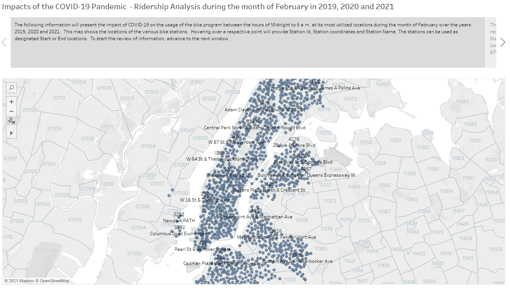
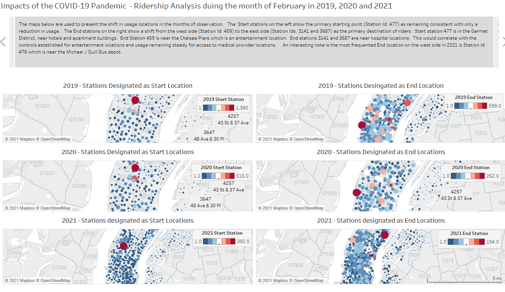
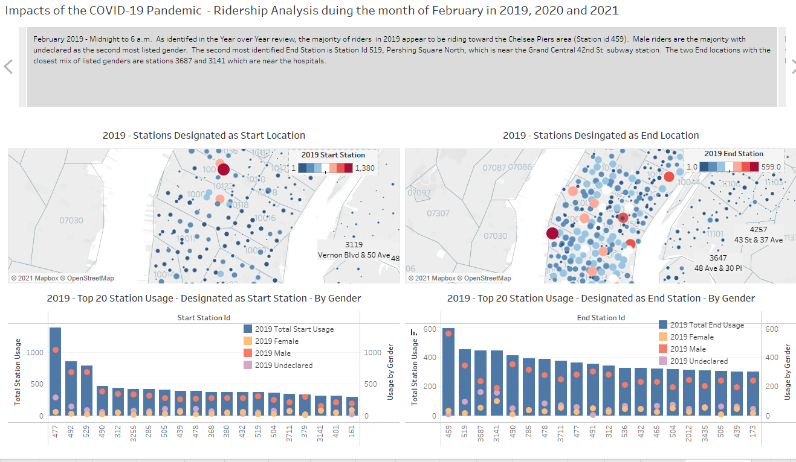
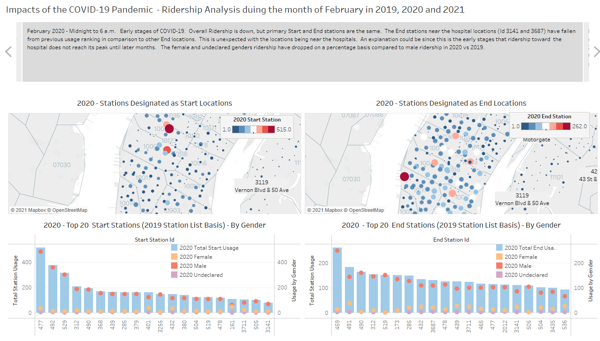
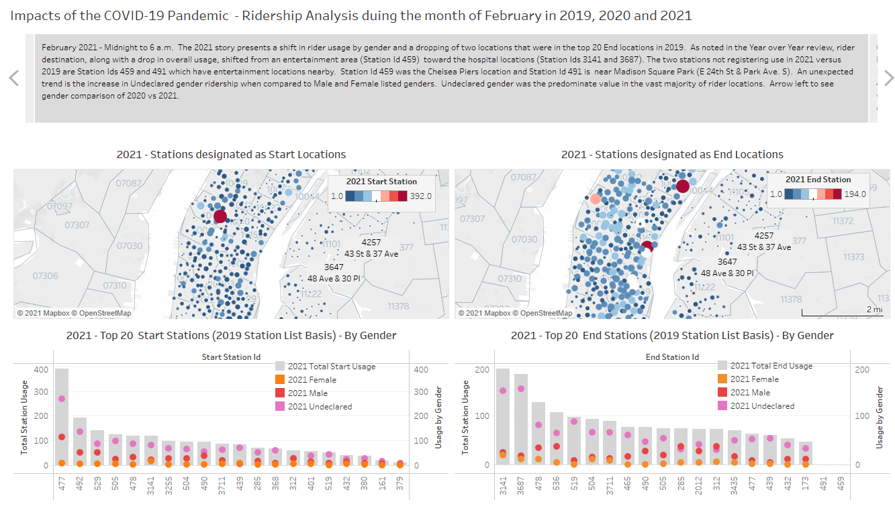
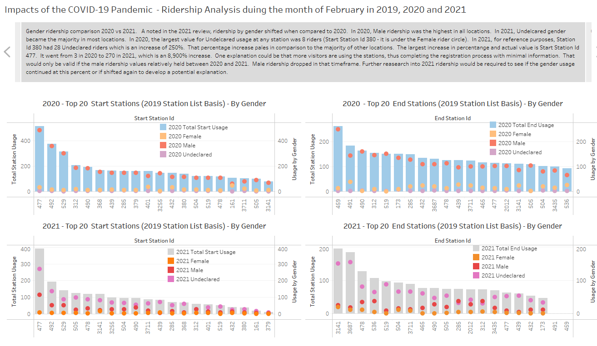
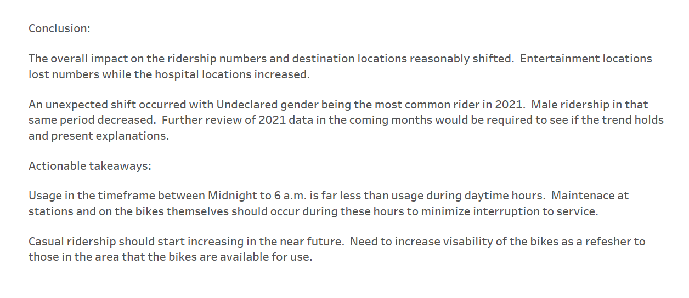

# Tableau_HW20
20210417

The Tableau homework was to create a review of Citi Bike usage in New York City using Tableau.  

The ridership usage before, during and post COVID-19 full control measures being implemented was conducted.  The latest month in 2021 avaialble for reivew at the time of the assignment was February 2021, therefore February data was collected for 2019 and February 2021.  The respective days of the month were then broken into descrete 6-hour time blocks to track trends.  Unfortunately, only the file for the Midnight to 6 a.m. block was small enough to be used in Tableau public.  The data did present interesting information and that was presented in the Tableau activity.

Python was used to sort the data and create csv files for the desired timeframe which were then managed in Tableau.

Images of the presentation

Link to the Tableau page <a href="https://public.tableau.com/profile/troy.youngblood#!/vizhome/Final_Bike_Analytics_Feb_ty/Covid_Impact?publish=yes">Citi Bike Usage NYC Comparison Fed 2019, 2020 and 2021</a>. 

Link to the code and Tableau file  
Python: [Python](Resources/final_HW20.ipynb) 
Python: [Citi Bike Usage NYC Comparison Feb 2019, 2020 and 2021](Resources/final_HW20.ipynb) 
Tableau: [Citi Bike Usage NYC Comparison Feb 2019, 2020 and 2021](Citi Bike Usage NYC Comparison Feb 2019, 2020 and 2021.twbx) 

Images from page

Overall Station View  
 
 
Comparion of Station usage over target years 
 
 
2019 Review  
 
 
2020 Review  
 
 
2021 Review 
 
 
202 vs 2021 Gender Usage review  
 
 
Conclusion and Actionable Items  
 
 

